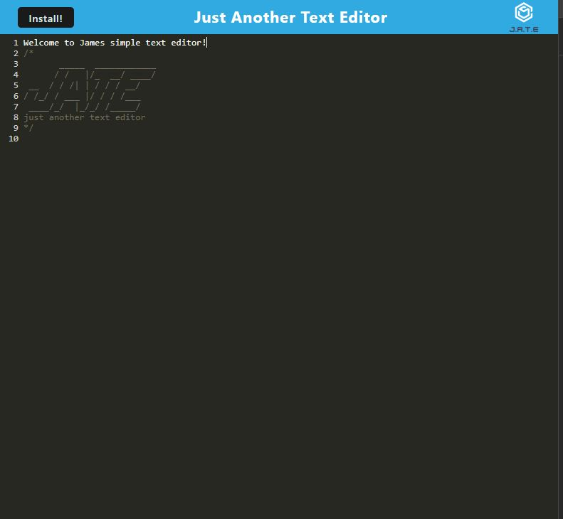

  
  # Text-Editor

  ## Description
  A single-page application that will function offline and will be installable. This will feature a number of data persistence techniques that serve as redundancy in case one of the options is not supported by the browser.

  ## Table of Contents
  * [Installation](#install)
  * [Usage](#usage)
  * [Contributions](#contribute)
  * [Test](#test)
  * [Credits](#credits)
  * [License](#license)
  * [Link](#link)
  * [Questions](#question)
  
  ## Installation
  GitBash

  Node

  ## Usage 
  An application that can be used offline or online that is a simple text editor. Go to my deployed site, you can view this downloaded or in the browser.

  ## Contributions
  N/A

  ## Test
  Please invoke this application with 'npm run start'

  ## Credits
  Text-Editor Starter Code from github user: Xandromus in Repository: cautious-meme. See below for link to repository: https://github.com/coding-boot-  
  camp/cautious-meme

  ## License
  GNU

  ## Link to deployed site
  https://murmuring-savannah-07320-fe88749f280e.herokuapp.com/

  ## Screenshot of deployed Application
  

  ## Question
  Please refer to my github for other awesome projects! https://github.com/james-brainard

  If you have any questions regarding this application or any others. You can reach me at: james.brainard202@gmail.com
